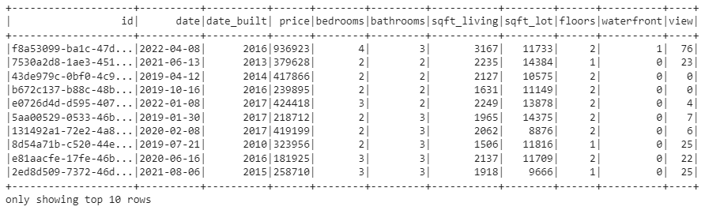
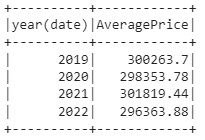
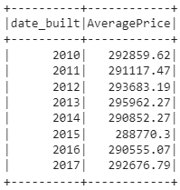
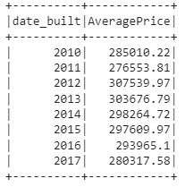
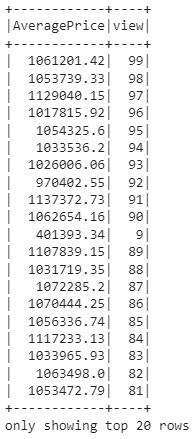
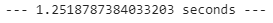
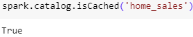
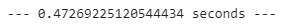
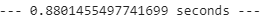
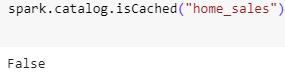

# Home-Sales-PySpark-SparkSQL

##  **Introduction**
Navigating this dynamic environment, the task at hand involves using SparkSQL skills to determine key metrics in home sales data, creating temporary views, partitioning data, and efficiently managing the caching and uncaching of tables, ensuring precision and efficiency in the world of Apache Spark and PySpark. 

## **Analysis**

#### A Spark DataFrame is created from the dataset.

#### A temporary table of the original DataFrame is created.  

    home_sales_df.createOrReplaceTempView('home_sales')

#### A query is written that returns the average price, rounded to two decimal places, for a four-bedroom house that was sold in each year. 

    spark.sql("""
            SELECT YEAR(date),
            Round(AVG(price),2)
            AS AveragePrice
            FROM home_sales
            WHERE bedrooms==4
            GROUP BY YEAR(date)
            ORDER BY Year(date) ASC
            """).show()

#### A query is written that returns the average price, rounded to two decimal places, of a home that has three bedrooms and three bathrooms for each year the home was built. 

    spark.sql("""
            SELECT YEAR(date_built) AS date_built,
            Round(AVG(price),2) AS AveragePrice
            FROM home_sales
            WHERE bedrooms==3 
            And bathrooms==3
            GROUP BY YEAR(date_built)
            ORDER BY date_built ASC
            """).show()

            

#### A query is written that returns the average price of a home with three bedrooms, three bathrooms, two floors, and is greater than or equal to 2,000 square feet for each year the home was built rounded to two decimal places. 

    spark.sql("""
            SELECT YEAR(date_built) AS date_built,
            Round(AVG(price),2) AS AveragePrice
            FROM home_sales
            WHERE bedrooms==3 
            And bathrooms==3
            And floors==2
            And sqft_living>=2000
            GROUP BY YEAR(date_built)
            ORDER BY date_built ASC
            """).show()

#### A query is written that returns the average price of a home per "view" rating having an average home price greater than or equal to $350,000, rounded to two decimal places. The output shows the run time for this query 1.25. 

    spark.sql("""
            SELECT ROUND(AVG(price), 2) AS AveragePrice, view
            FROM home_sales
            WHERE price >= 350000
            GROUP BY view
            ORDER BY view DESC
            """).show()

#### A cache of the temporary "home_sales" table is created and validated.

    spark.sql('cache table home_sales')

    

#### The query from previous step is run on the *cached temporary table*, and the run time is computed with a better efficiency of 0.47 seconds.  

 

#### A partition of the home sales dataset by the "date_built" field is created, and the formatted parquet data is read.

    home_sales_df.write.parquet('parquet_home_sales', mode='overwrite')
    p_df=spark.read.parquet('parquet_home_sales')

#### A temporary table of the parquet data is created. 

    p_df.createOrReplaceTempView('p_homes_sales')

#### The same query is run on the parquet temporary table, and the run time is computed with efficiency of 0.88 seconds.  

    spark.sql("""
            SELECT ROUND(AVG(price), 2) AS AveragePrice, view
            FROM p_homes_sales
            WHERE price >= 350000
            GROUP BY view
            ORDER BY view DESC
            """).show()

#### The "home_sales" temporary table is uncached and verified. 

    spark.sql('uncache table home_sales')

## Results
In this dataset, the most efficient runtime was the *cached temporary table* without the partitioned field. However, this difference is negligible. The results show that using a cached table is best practice when using queries on large datasets.
